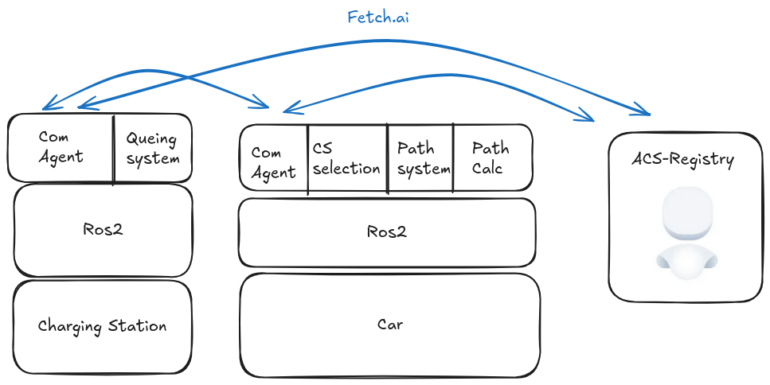

# AutoCharge

## Repositories

### [ACS-Registry](https://github.com/Diplomarbeit-PGHFP-2024-2025/acs-registry)

**AutoChargeStation-Registry** is a centralized registry for all station.
There all station need to register so cars can discover them.

### [ACA-Protocols](https://github.com/Diplomarbeit-PGHFP-2024-2025/aca-protocols)

**AutoChargeAgent-Protocols** is a library used for all Agents. It mainly exposes types for agentProtocols.